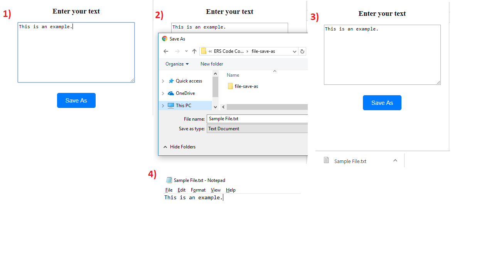

# File Save As

Light weight file 'Save As' angular component without external libraries/dependencies.



## Demo

Checkout the demo on StackBlitz - https://angular-file-save-as.stackblitz.io

## Features
```
1) Save your data as local file in the system.
2) Save file with custom extension. Example - '.xyz' or '.abc'
3) Set default file name and file extension of your choice
```

## Adding the component in your project

### Add Component in module
Import
`
import { FileSaveAsComponent } from './file-save-as/file-save-as.component';
`

Declaration
`
declarations: [
    FileSaveAsComponent
  ]
`

### Add selector in HTML
```
<file-save-as [fileContent]="fileData"></file-save-as>
```

### Selector Properties
Property `fileContent` accepts the data you want to save in file.

### file-save-as.component.ts
``` typescript
import { Component, Input } from '@angular/core';

@Component({
  selector: 'file-save-as',
  templateUrl: './file-save-as.component.html',
  styleUrls: ['./file-save-as.component.scss']
})
export class FileSaveAsComponent {
  @Input() fileContent: any;

  //you can enter your own file name and extension
  saveAsProject(){
    this.writeContents(this.fileContent, 'Sample File'+'.txt', 'text/plain');
  }
  writeContents(content, fileName, contentType) {
    var a = document.createElement('a');
    var file = new Blob([content], {type: contentType});
    a.href = URL.createObjectURL(file);
    a.download = fileName;
    a.click();
  }
}

```

### file-save-as.component.ts.component.html
``` typescript
<div class="file-container">
  <button class="file-button" (click)="saveAsProject()">Save As</button>
  <br>
</div>
```

### file-save-as.component.ts.component.scss
``` typescript
.file-container{
    text-align: center;
  }
.file-button{
    outline: none;
    cursor: pointer;
    border: 1px solid #007bff;
    border-radius: 5px;
    background: #007bff;
    color: #fff;
    font-size: 15px;
    padding: 10px;
    margin: 5px 10px;
    min-width: 100px;
  }
.file-button:hover{
    background: #0069d9;
    border: 1px solid #0062cc;
  }
```


## Author

animesh.rawat20@gmail.com
