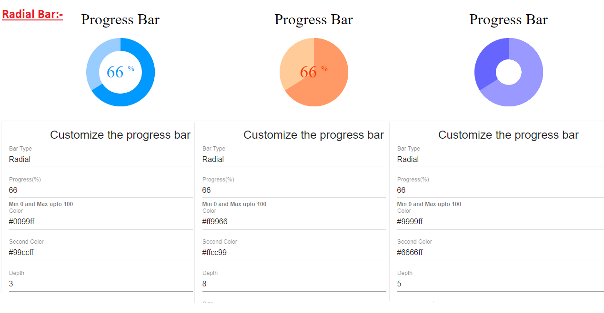

# Progress Bar

Fully customizable, responsive and light weight 'Progress Bar' angular component without external libraries/dependencies. Special effort has been made to keep the component files free from coding logic which has been handled on the HTML file of the component.




## Demo

Checkout the demo on StackBlitz - https://angular-progress-linear-radial-bar.stackblitz.io/

## Features
```
1) Change between 'linear' and 'radial' progress bar.
2) Fully 'customizable'. Change color, size, label properties, animations etc. 
3) 'Responsive' design to adjust all type of project requirements.
```

## Upcoming Features
```
1) 'Vertical' mode for 'linear' bar.
2) Custom HTML template option for content inside the center of 'radial' bar. 
3) Overall structural changes to separate both 'linear' and 'radial' bars at a component level.
4) Update readme file and add detailed property description in table format.
```

## Adding the component in your project

### Add Component in module
Import
`
import { ProgressBarComponent } from './progress-bar/progress-bar.component';
`

Declaration
`
declarations: [
    ProgressBarComponent
  ]
`

### Add selector in HTML
```
<progress-bar [barProperties]="barOptions"></progress-bar>
```

### Selector Properties
Property `barProperties` accepts JSON object which customize the progress bar according to user choice.

You can send value `linear` for linear bar and `radial` for radial bar with `barType` key.

Key `progress` can have value between 0 to 100.

Change and play with other key-values to get bar which fits your purpose.


### Sample JSON Object
``` typescript
barOptions = {
    barType: 'linear', //or 'radial' for radial bar
    color: "#0e90d2",
    secondColor: "#D3D3D3",
    progress: 66, //between 0 to 100
    linear: {
      depth: 22,
      stripped: true,
      active: true,
      label: {
        enable: true,
        value: "Linear Bar",
        color: "#fff",
        fontSize: 15,
        showPercentage: true,
      }
    },
    radial: {
      depth: 3, //max 8
      size: 9,
      label: {
        enable: true,
        color: "#09608c",
      }
    }
  }
```


## Author

animesh.rawat20@gmail.com
